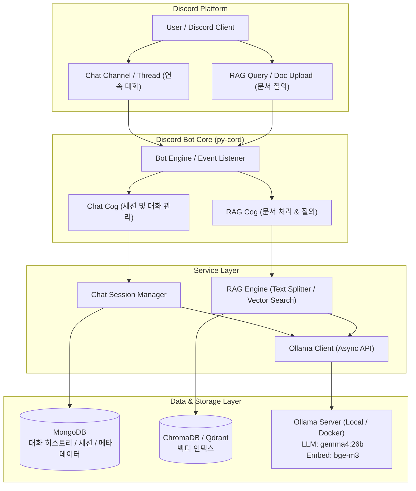

# Discord LLM Bot 아키텍처 및 Ollama 모델 선정 가이드

본 문서는 RAG(Retrieval-Augmented Generation) 기능과 채팅 탭 연속 대화 기능을 탑재한 **Discord LLM Bot**의 추천 Ollama 모델 선정 및 전체 시스템 아키텍처 설계를 다둡니다.

---

## 1. Ollama 모델 선정 가이드

Discord 챗봇의 **한국어 대화 품질**, **RAG 컨텍스트 이해도**, **추론 속도**, **VRAM/메모리 요구사항**을 종합적으로 고려한 추천 모델입니다.

### 1.1 메인 LLM (텍스트 생성 / 대화용)

| 모델명 | 매개변수 | 메모리(VRAM) | 한국어 성능 | 추천 목적 및 특징 |
| :--- | :--- | :--- | :--- | :--- |
| **Gemma 4 (현재 적용 ⭐)** | `26b` | ~16~20 GB | **최상+** | **현재 적용 모델**. Google의 대규모 파라미터 모델로 한국어 대화 및 복잡한 추론/RAG 답변 품질 최상위. |
| **Qwen 2.5 (경량)** | `7b-instruct` | ~5~6 GB | **최상** | 경량화 환경 추천. 한국어 및 다국어 지시 이행 능력, RAG Context 인지력 우수. |
| **Qwen 2.5 (고성능)** | `14b-instruct`| ~10~12 GB | **최상+** | 여유 VRAM이 있을 때 고품질 대화 제공. |
| **Llama 3.1** | `8b-instruct` | ~5~6 GB | 보통~양호 | 범용성이 높음. |

> **💡 현재 프로젝트 사용 모델**: **`gemma4:26b`** 
> - 고성능 26B 파라미터를 기반으로 매우 자연스러운 한국어 표현력과 고품질 RAG 답변 능력을 제공합니다.

---

### 1.2 Embedding 모델 (RAG 벡터 검색용)

| 모델명 | 실행 방식 | 특징 및 장점 |
| :--- | :--- | :--- |
| **`bge-m3` (추천 ⭐)** | Ollama 또는 Python | 다국어/한국어 Dense & Sparse 임베딩 성능 최상위. RAG 검색 정확도 높음. |
| **`nomic-embed-text`** | Ollama | 8k 컨텍스트 지원, 가볍고 빠르게 임베딩 생성 가능. |
| **`ko-sroberta-multitask`** | Python (`sentence-transformers`) | 로컬 파이썬에서 한국어 문장 유사도 측정 시 안정적인 검증된 모델. |

---

## 2. 전체 시스템 아키텍처



---

## 3. 핵심 기능별 세부 구현 구조

### 3.1 채팅 탭 (Chat Tab) 연속 대화 관리
- **스레드/특정 채널 지정**: 챗봇 전용 채널이나 스레드가 생성되면 해당 `channel_id` / `thread_id`를 하나의 **대화 세션(Session)**으로 식별합니다.
- **대화 히스토리 (MongoDB)**:
  - Collection: `chat_sessions`
  - 데이터 구조:
    ```json
    {
      "session_id": "channel_123456789",
      "user_id": "user_987654321",
      "messages": [
        {"role": "system", "content": "너는 친절한 디스코드 AI 도우미야."},
        {"role": "user", "content": "안녕!"},
        {"role": "assistant", "content": "안녕하세요! 무엇을 도와드릴까요?"}
      ],
      "updated_at": "2026-09-20T10:14:00Z"
    }
    ```
- **Context Window 슬라이딩 기법**: 메모리 초과를 방지하기 위해 최근 N개의 대화 이력만 Ollama Prompt로 전달합니다.

---

### 3.2 RAG (Retrieval-Augmented Generation) 파이프라인
1. **문서 수집 (Ingestion)**:
   - 디스코드 파일 첨부 (`.pdf`, `.txt`, `.md` 등) 또는 `/upload` 명령어 사용.
   - Text Splitter (예: `RecursiveCharacterTextSplitter`)를 통해 적절한 크기(Chunk Size: 500~1000, Overlap: 100)로 분할.
2. **임베딩 및 저장 (Embedding & Storage)**:
   - Ollama `bge-m3` 임베딩 생성 -> ChromaDB / Qdrant 벡터 데이터베이스에 인덱싱 및 메타데이터 저장.
3. **검색 및 답변 생성 (Retrieval & Generation)**:
   - 사용자 질문 -> 질문 벡터화 -> Vector DB에서 Top-K(예: 3~5개) 관련 문서 검색.
   - System Prompt 구성:
     ```text
     [참고 문서]
     {retrieved_chunks}

     [위 문서를 바탕으로 사용자의 질문에 한국어로 정확하게 답변하세요.]
     질문: {user_query}
     ```
   - Ollama LLM에 전달 후 답변 스트리밍/반환.

---

## 4. 추천 디렉토리 구조

기존 디렉토리 구조를 유지하면서 `rag/` 모듈 및 Cog 분리를 반영한 확장 구조입니다:

```text
Discord-LLM-Bot/
├── GEMINI.md
├── docs/
│   └── architecture_plan.md    # 아키텍처 및 Ollama 모델 선정 가이드
├── docker/
│   └── docker-compose.yml       # Discord Bot, MongoDB, ChromaDB/Qdrant
├── src/
│   ├── run.py                   # 봇 실행 메인 엔트리포인트
│   ├── constants.py
│   ├── cogs/
│   │   ├── chat_cog.py          # [신규] 채팅 탭 및 연속 대화 핸들러
│   │   ├── rag_cog.py           # [신규] RAG 문서 업로드 및 검색 질의 핸들러
│   │   └── llm_cog.py           # 기존 슬래시 명령 등
│   ├── database/
│   │   ├── mongo_db.py          # MongoDB 대화 세션 CRUD
│   │   └── vector_db.py         # [신규] ChromaDB / Qdrant 벡터 검색 인터페이스
│   ├── rag/                     # [신규] RAG 모듈
│   │   ├── document_loader.py   # PDF, TXT, MD 파일 텍스트 추출 및 Chunking
│   │   ├── embedder.py          # Ollama/SentenceTransformer 임베딩 연동
│   │   └── retriever.py         # RAG 프롬프트 빌더 및 검색기
│   ├── llm/
│   │   ├── base_llm.py
│   │   └── ollama_client.py     # Ollama 비동기 API 클라이언트
│   └── util/
├── tests/
│   ├── test_chat_session.py     # 세션 히스토리 테스트
│   ├── test_rag_pipeline.py     # 문서 분할 및 임베딩/검색 테스트
│   └── test_ollama_client.py   # Ollama API 호출 테스트
└── requirements.txt
```

## 5. 핵심 기술 스택 및 라이브러리

- **패키지 및 환경 관리**: `uv`
  - 빠르게 파이썬 가상환경(`uv venv`)을 생성하고 패키지 의존성(`uv pip install`, `uv add`)을 관리합니다.
  - 실행 명령어: `uv run python src/run.py` 또는 `uv run pytest`
- **설정 및 구성 관리**: `hydra-core` (`omegaconf`)
  - 봇 설정(LLM 파라미터, DB 연결 URI, RAG 검색 상수 등)을 YAML 파일 기반의 계층적 구조로 체계적으로 통합 관리합니다.

---

## 6. 단계별 구현 로드맵

1. **1단계: 개발 환경 구성 & 의존성 업데이트 (`uv` 및 `hydra-core`)**
   - `uv`를 통한 가상환경 생성: `uv venv`
   - 의존성 설치: `uv pip install -r requirements.txt` (`hydra-core`, `chromadb`, `pytest-asyncio` 포함)
   - Hydra 기반 설정 파일(`configs/config.yaml`) 준비
   - Ollama에 `qwen2.5:7b` 및 `bge-m3` 모델 pull (`ollama pull qwen2.5:7b`, `ollama pull bge-m3`)
2. **2단계: MongoDB 기반 채팅 탭 (연속 대화) 구현**
   - `mongo_db.py`에 세션 대화 저장/조회 기능 개발
   - `chat_cog.py` 구현 (스레드/채널 내 메시지 감지 및 대화 유지)
3. **3단계: RAG 모듈 & Vector DB 구축**
   - `vector_db.py` 및 `document_loader.py` 작성
   - `rag_cog.py` 구현 (파일 업로드 처리 및 `/rag` 검색 명령 지원)
4. **4단계: 테스트 및 Pytest 검증**
   - 세션 관리 및 RAG 검색 기능 단위/통합 테스트 진행 (`uv run pytest`)

